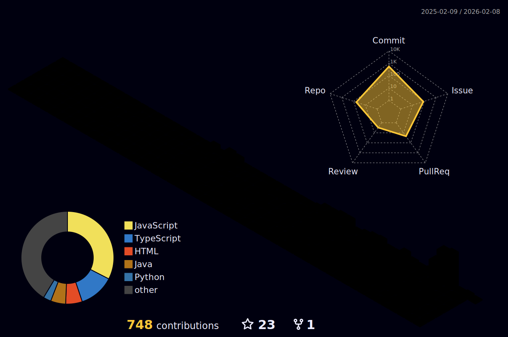

  

  

  &nbsp;&nbsp;&nbsp;

  &nbsp;&nbsp;&nbsp;

  &nbsp;&nbsp;&nbsp;

  

 

  

 

  

 

<h2 align="center">⚡ Engineering Impact & Open Source</h2>

<i>I don't just use libraries; I optimize them. Here are my contributions to the tools you use every day.</i>

  <table width="100%">
    <tr>
      <th width="25%">Library / Org</th>
      <th width="55%">Contribution Details</th>
      <th width="20%">Status</th>
    </tr>
    <tr>
      <td>
         <strong>Next.js</strong>
      </td>
      <td>
        Contributed to the core framework code (PR #87244).
      </td>
      <td>
        
      </td>
    </tr>
    <tr>
      <td>
         <strong>Textualize/Rich</strong>
      </td>
      <td>
        <strong>PR #3916:</strong> Improved terminal UI rendering capabilities.
      </td>
      <td>
        
      </td>
    </tr>
    <tr>
      <td>
         <strong>ChatGPT Prompts</strong>
      </td>
      <td>
        <strong>PR #954:</strong> Optimized prompt engineering resources for developers.
      </td>
      <td>
        
      </td>
    </tr>
    <tr>
      <td>
         <strong>Jellyfin</strong>
      </td>
      <td>
        Identified and debugged critical media playback issues.
      </td>
      <td>
        
      </td>
    </tr>
  </table>

 

<h2 align="center">🛠 The Arsenal</h2>

  

 

<h2 align="center">🚀 Production Deployments</h2>

  <table width="100%">
    <tr>
      <th width="25%">Project</th>
      <th width="45%">Description</th>
      <th width="15%">Stack</th>
      <th width="15%">Links</th>
    </tr>
    <tr>
      <td>
        <strong>⚛️ ReactAtom</strong>
      </td>
      <td>
        The next generation of atomic, reusable React components. Build stunning UIs with copy-paste simplicity.
      </td>
      <td>
        <code>React</code>
        <code>TypeScript</code>
        <code>Tailwind</code>
      </td>
      <td>
        
      </td>
    </tr>
    <tr>
      <td>
        <strong>🍎 MacOS Landing</strong>
      </td>
      <td>
        A pixel-perfect, 3D interactive recreation of the macOS desktop experience in the browser.
      </td>
      <td>
        <code>React</code>
        <code>Framer</code>
      </td>
      <td>
        
      </td>
    </tr>
    <tr>
      <td>
        <strong>🌌 Zenith Studio</strong>
      </td>
      <td>
        High-performance cinematic gaming landing page featuring advanced GSAP scroll-triggered animations and immersive visual storytelling.
      </td>
      <td>
        <code>React</code>
        <code>GSAP</code>
        <code>Tailwind</code>
      </td>
      <td>
        
      </td>
    </tr>
    <tr>
      <td>
        <strong>🤖 CoreOps</strong>
      </td>
      <td>
        (In Development) An AI Automation Agency infrastructure for enterprise scaling.
      </td>
      <td>
        <code>AI</code>
        <code>Next.js</code>
      </td>
      <td>
        
      </td>
    </tr>
  </table>

 

<h2 align="center">📊 The Data</h2>

  
  
  
    
  
  <table align="center" width="100%">
    <tr>
      <td width="50%" align="center">
        
      </td>
      <td width="50%" align="center">
        
      </td>
    </tr>
  </table>

   
  
    

 

<h2 align="center">🏆 Achievements</h2>

  

 

  

 

  

